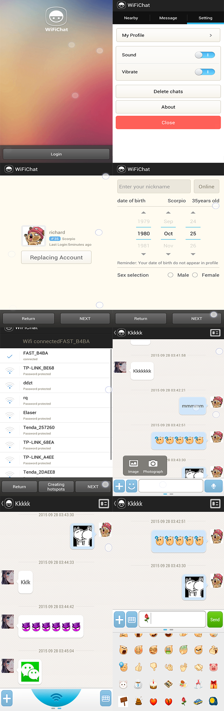

Android WifiChat
====

This repository contains the source code for the WifiChat.

The project is based on wifi network chat program source. In Wifi environment, you can use a direct connection. In the absence of Wifi environment, the LAN can be established by creating a hot way. Because it is a P2P mode, no separate server. Supports sending text, pictures, voice, document (some features still in development).

